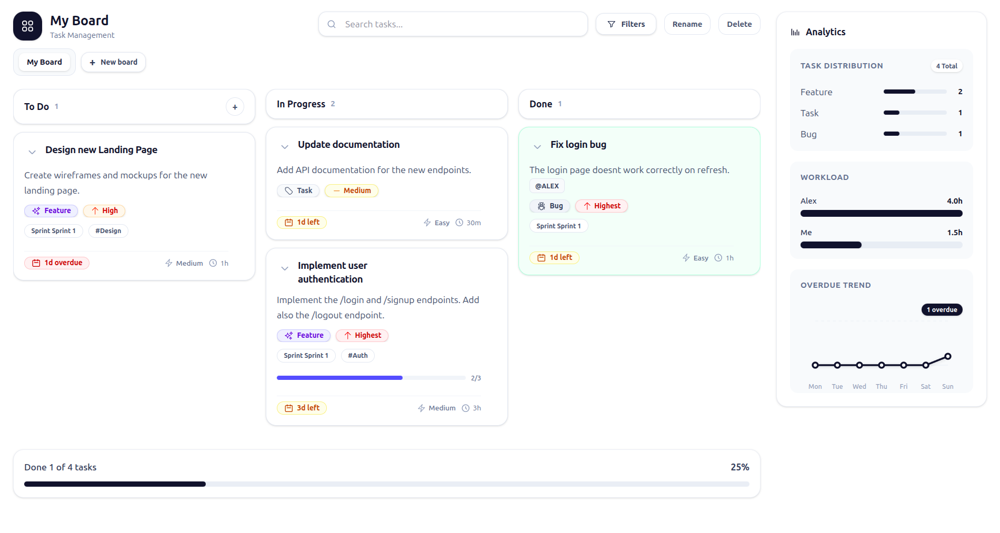

# Boardify: A Lightweight, Feature-Rich Kanban Board

Boardify is a minimal-footprint, yet powerful task-management board built with **Next.js (React)** and styled with **Tailwind CSS**. It supports multiple boards, custom columns, and a rich set of features for seamless task tracking. An optional backend service using **Node.js, Express, and PostgreSQL** provides persistent storage and user authentication.

<br>

<p align="center">
  
</p>

## Features

### Core Functionality
- **Multiple Boards**: Create and manage up to 3 distinct boards.
- **Custom Columns**: Organize tasks in default columns (`To Do`, `In Progress`, `Done`) or add your own.
- **Drag-and-Drop**: Intuitively move tasks between columns.
- **Persistent Storage**: Optional backend saves all boards, columns, and tasks to a PostgreSQL database.
- **Authentication**: Sign up / log in with accounts stored in Postgres (sessions via httpOnly cookies).

### Rich Task Management
- **Detailed Task Creation**: Add tasks with assignees, types, priorities, difficulty, time estimates, due dates, and more.
- **Subtasks**: Break down complex tasks into a checklist of smaller items with its own progress bar.
- **Filtering**: Quickly find tasks by type, assignee, priority, sprint, or other attributes.
- **Inline Editing**: Click any task or board title to edit it on the fly.
- **Due Date Status**: See visual badges for tasks that are `Overdue`, `Due Soon`, or `Upcoming`.
- **Mentions**: Use `@` to tag team members in task descriptions with autocomplete support.

### Collaborative Features
- **Shared Boards**: Create boards that can be shared with other users for real-time collaboration.
- **Role-Based Access**: Assign roles (`Admin` or `Member`) to control permissions (e.g., only admins can delete boards or invite others).
- **Email Invitations**: Invite users by email. If they don't have an account, the invite waits until they sign up.
- **Invite Management**: Secure token-based invite acceptance with expiration (configurable via `COLLAB_INVITE_TTL_DAYS`).

### Analytics & UI
- **Task Summary**: A real-time sidebar count of tasks organized by type.
- **Analytics Dashboard**: Visualize task distribution, developer workload (by estimated hours), and overdue trends.
- **Progress Bars**: Track overall project completion (`To Do` vs. `Done`) and subtask progress.
- **Responsive Design**: Enjoy a seamless experience on both desktop and mobile, with an adaptive layout.

## Tech Stack

- **Frontend**: Next.js, React, Tailwind CSS
- **Backend**: Node.js, Express.js
- **Database**: PostgreSQL (via Docker)
- **Primary State Management**: React Hooks (`useState`, `useReducer`, `useContext`)

## Getting Started

### Prerequisites
- Node.js (v20.19+ recommended)
- npm
- Docker (for backend)

### Installation & Setup

#### Docker Configuration
Runs Postgres + backend + frontend with one command.

```bash
docker compose up --build
```

- Note: this requires Docker Compose v2 (`docker compose`). The legacy v1 binary (`docker-compose`) can fail on newer Docker versions with errors like `KeyError: 'ContainerConfig'`.

- Frontend: `http://localhost:5173`
- Backend: `http://localhost:3000`
- Postgres: `localhost:5433` (container port `5432`)

Postgres credentials (defaults): database `mydb`, user `myuser`, password `mypassword`.

Optional: copy `/.env.example` to `/.env` to document local env vars (Docker Compose already sets defaults for Docker).

Notes:
- The app routes are `/auth` (login/signup), `/board` (personal boards), `/collab` (collaborative boards), and `/profile` (user profile).
- There is also a backend-only Postgres compose file at `boardify-backend/docker-compose.yml` (publishes `5434:5432`). Don’t run it alongside the main `docker-compose.yml`.

## API Endpoints
The backend exposes the following RESTful endpoints.

| Method | Endpoint      | Description                                                 |
|--------|---------------|-------------------------------------------------------------|
| `GET`  | `/api/boards` | Retrieves all personal boards.                              |
| `GET`  | `/api/boards/:id` | Retrieves a single personal board by its ID.            |
| `POST` | `/api/boards`     | Creates a new personal board.                           |
| `PUT`  | `/api/boards/:id` | Updates an existing personal board.                     |
| `DELETE`| `/api/boards/:id` | Deletes a personal board by its ID.                     |
| `GET`  | `/api/collab-boards` | Retrieves authenticated user's collaborative boards. |
| `POST` | `/api/collab-boards` | Creates a new collaborative board.                   |
| `GET`  | `/api/collab-boards/:id` | Retrieves a specific collaborative board.        |
| `PUT`  | `/api/collab-boards/:id` | Updates a collaborative board.                   |
| `DELETE`| `/api/collab-boards/:id` | Deletes a collaborative board (Admin only).     |
| `POST` | `/api/collab-boards/:id/invite` | Invites a user by email (Admin only).     |
| `POST` | `/api/collab-invites/accept` | Accepts an invite via token.                 |
| `GET`   | `/api/task-types` | Retrieves all available task types.                       |
| `POST`  | `/api/task-types` | Adds a new task type.                                     |
| `GET`   | `/api/auth/me` | Returns the current authenticated user (cookie session). |
| `POST`  | `/api/auth/signup` | Creates a user and starts a session.                  |
| `POST`  | `/api/auth/login` | Logs a user in and starts a session.                  |
| `POST`  | `/api/auth/logout` | Logs out (clears the session).                       |

## Next steps
- Add real-time WebSocket updates for collaborative boards

## License
This project is licensed under the MIT License - see the [LICENSE](LICENSE) file for details.
